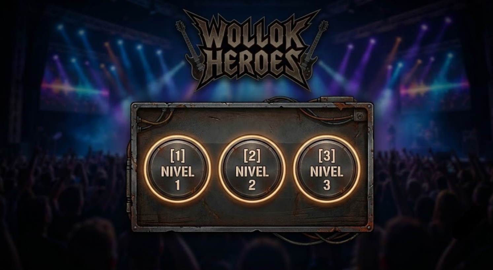
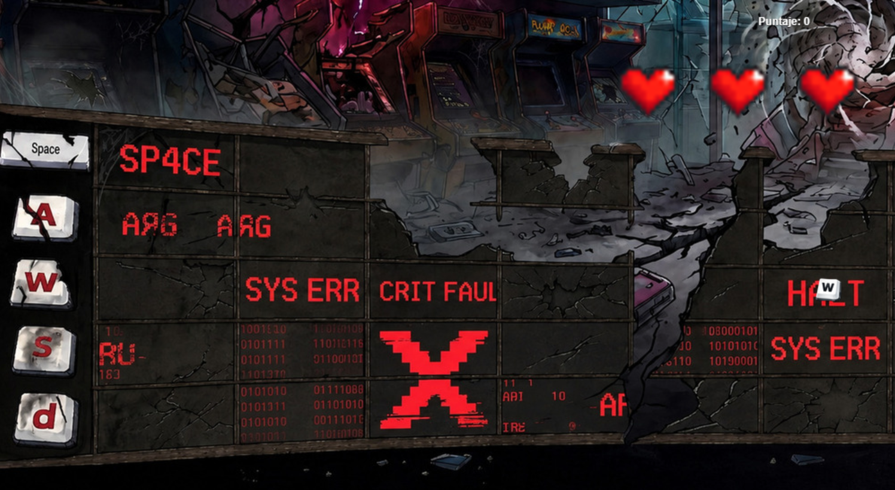
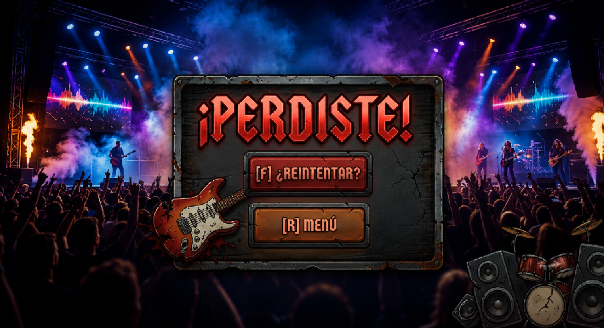

# Nombre del juego (<- borrar y completar)

WOLLOK HERO

## Equipo de desarrollo

- Gabriel D'Esposito
- Demian Bava
- Pilar Gómez
- Lautaro Arroyo

## Capturas

## Reglas de Juego / Instrucciones

¡Intenta tocar la nota correcta cuando llegue al apartado izquierdo de la pantalla!
¡Suma la mayor cantidad de puntos posibles!

## Otros

- Curso: Programación con Objetos 1
- Universidad: Universidad Nacional de Quilmes
- Versión de wollok: 1.0.3
- Una vez terminado, no tenemos problemas en que el repositorio sea público.
